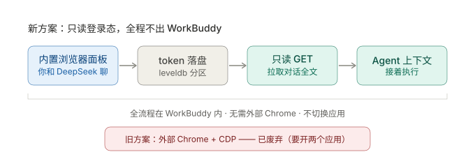

# iskill-workbuddy-deepseek

> **WorkBuddy 专用。** 本技能依赖 WorkBuddy 内置浏览器的分区目录
> （`~/.workbuddy-ai/app/session/Partitions/`）来读取 DeepSeek 登录态。
> 换成 Codex / Claude Code / Cursor 等客户端没有这个路径，脚本无法工作。

解决一个具体痛点：**讨论用免费的 DeepSeek 网页版，执行用付费的 agent 客户端，两边切换要手动搬运上下文。**

本 skill 让搬运变成一句话：

```
用户在 WorkBuddy 内置浏览器面板里和 DeepSeek 聊
        ↓  说一句「同步一下 DeepSeek 最新对话」
agent 跑 ds-sync.mjs（只读 GET）→ 对话内容进入 agent 上下文
```

**全程不离开 WorkBuddy，不需要外部 Chrome。**



---

## 核心原理（先读，否则会误判）

| 事实 | 说明 |
|---|---|
| 内置浏览器**无法被驱动** | 它是 Electron webview，**没有暴露 CDP 调试端口**，分区里也没有 `DevToolsActivePort`。所以 agent-browser / CDP 那套在它身上**用不了**。 |
| 但它的**分区在磁盘上** | `~/.workbuddy-ai/app/session/Partitions/<name>/Local Storage/leveldb` |
| `userToken` 就在里面 | DeepSeek 网页版把登录凭证存在 `localStorage.userToken`，形如 `{"value":"<64位不透明token>","__version":"0"}` |
| 拿到 token 就能**只读**拉对话 | `GET /api/v0/chat_session/fetch_page`、`GET /api/v0/chat/history_messages` |

所以：**不驱动浏览器，只读它的登录态 + 调只读接口。**

## 风险边界（必须如实告知用户）

- ✅ 只调 **GET 只读**接口：列会话、取历史消息
- ✅ **不调** `/chat/completion`、**不做** PoW、**不做** prompt 注入、**不高频轮询**
- ✅ 真正的「生成」始终发生在**真实浏览器**里，指纹/device_id 都是真的
- ⚠️ 但仍是**非浏览器 HTTP 客户端**（TLS/UA 指纹与 Chrome 不同），属**低但非零**风险
- ⚠️ 因此：**按需调用，不要轮询、不要批量刷**

> 这与「把网页版封装成 OpenAI API」**不是一个量级**：那个方案要高频调用 completion 并做 prompt 注入，已被大量封号案例证伪。本方案不碰生成链路。

**反向（`push`）的风险更低 —— 它是零。** `push` 只把文本放进系统剪贴板，**完全不碰网络**，
由用户自己粘贴到面板里。这是刻意的：程序化「发送消息」才是封号风险的来源，所以这条路不自动化。

> ⚠️ **不要给本技能加「自动发消息到 DeepSeek」。** 那需要 `POST /chat/completion` + PoW，
> 等于把已经排除掉的高风险方案重新引进来（论证见 `docs/DeepSeek网页版转API-可行性评估.md`）。

## 用法

脚本：`scripts/ds-sync.mjs`（Node，无第三方依赖）

```bash
NODE=~/.workbuddy-ai/binaries/node/versions/22.22.2-3/bin/node
S=<skill目录>/scripts/ds-sync.mjs

$NODE $S status                  # 登录状态 + 账号 + 分区定位
$NODE $S list --count 20         # 最近会话列表（带序号）
$NODE $S pull --latest           # 导出最近一次会话为 markdown（默认 stdout）
$NODE $S pull --title EWC        # 按标题模糊匹配
$NODE $S pull --id <session_id>  # 按 ID
$NODE $S pull --index 2          # 按 list 序号
$NODE $S pull --latest --think   # 连思考过程一起导出
$NODE $S pull --latest --tail 6  # 只要最后 6 条
$NODE $S pull --latest --out x.md
$NODE $S partitions              # 排查用：列出所有分区及 token 情况

# 反向：把内容放进剪贴板，由你粘到面板里（WorkBuddy → DeepSeek）
$NODE $S push --file draft.md              # 从文件读
$NODE $S push --text "结论是……"             # 直接给
cat draft.md | $NODE $S push               # 从 stdin 读
$NODE $S push --file draft.md --out x.md   # 不碰剪贴板，写文件
$NODE $S push --file draft.md --no-header  # 不加「来自 WorkBuddy」抬头
$NODE $S push --file draft.md --no-copy    # 只统计，不碰剪贴板
```

> `push` **不需要登录态** —— 它不读 token、不发任何请求，所以未登录也能用。

## 打开 DeepSeek（无需脚本，默认动作）

用户说「打开 DeepSeek」/「我要和 DeepSeek 聊」，**或者只笼统说了「同步一下 DeepSeek」而没给任何具体要求**（没指定会话、没说只导出、没说反向推送）时，**第一步都先用 `present_files` 打开 `https://chat.deepseek.com/`**——页面会在 **WorkBuddy 内置浏览器面板**中显示（实测有效，见 `docs/DeepSeek网页版桥接-方案.md` 2.3 节）。面板打开后再继续后续步骤（status / pull 等），用户能同时看到对话原文，方便核对。

不需要跑脚本——`present_files` 的 URL 预览通道恰好落在内置浏览器面板上。

典型场景：
- **无具体指令的默认动作**：「同步一下」「拉一下 DeepSeek」这类笼统触发，先开面板再干活。
- **首次登录**：面板打开后扫码登录，登录态落盘，之后 `status`/`pull` 即可用。
- **反向流程前**：`push` 只到剪贴板，用户需要一个已经开着 DeepSeek 的面板来粘贴。

> 也可以传具体会话 URL 让用户直接落到某条对话，但会话 ID 需先从 `pull`/`list` 输出里取。

## 消息结构（渲染依据）

`history_messages` 返回的每条消息，正文在 `fragments[]` 里（**不在 `content`**）：

| fragment `type` | 含义 | 默认 |
|---|---|---|
| `REQUEST` | 用户的话 | 包含 |
| `THINK` | 模型思考过程（可能上万字） | **省略**，`--think` 才包含 |
| `RESPONSE` | 模型正式回答 | 包含 |

## 标准执行流程

1. 用户说「同步一下 DeepSeek」/「把网页版的结论拿过来」。**若没给任何具体要求，先按「打开 DeepSeek」节用 `present_files` 开面板**（用户能边看原文边等结果）。
2. 跑 `ds-sync.mjs status` 确认登录态。失败 → 见下方排查。
3. 跑 `ds-sync.mjs pull --latest`（或按用户指定的标题/序号）。
4. 把内容当作**用户提供的上下文**继续干活；不要复述整篇，直接接着做。

## 反向流程：把 WorkBuddy 的产出送回 DeepSeek

1. 用户说「把结论发回 DeepSeek」/「同步到网页版」。
2. 把要送过去的内容整理好，写进一个临时文件（或直接用 `--text`）。
3. 跑 `ds-sync.mjs push --file <路径>`。
4. 若面板没开着 DeepSeek，先按「打开 DeepSeek」节用 `present_files` 打开。
5. 告诉用户：**内容已在剪贴板，去面板的输入框按 ⌘V 粘贴**。

**到剪贴板就结束。** 发送动作必须由人完成 —— 不要写脚本去模拟粘贴或调用接口。

## 排查

| 现象 | 原因 / 处理 |
|---|---|
| 找不到已登录会话 | 用户没在内置浏览器面板登录 DeepSeek。用 `present_files` 打开 `https://chat.deepseek.com/`（见「打开 DeepSeek」节），扫码登录。 |
| `status` 显示接口验证失败 | token 过期。在面板刷新/重登一次即可，脚本每次都会重新读磁盘，无需手动同步 token。 |
| **账号和刚登录的对不上**（读出旧账号） | webview 的 localStorage 尚未 flush 到磁盘——脚本读的是磁盘落盘态（看 `token 落盘` 一行的时间）。处理：**关闭内置浏览器面板重开（或切走再切回），等 2 秒重跑**。已实测：新登录可滞留内存 2 小时不落盘。 |
| `partitions` 里某个分区显示「未登录 (value=null)」 | 该分区是空壳，正常。挑显示「已登录」的那个。 |
| 会话列表为空 | 账号确实没有历史会话，或接口变更。用 `--raw` 看原始返回。 |
| 找不到标题匹配 | 用 `list` 看准确标题，注意是全角/半角与空格。 |
| `push` 报「没找到可用的剪贴板命令」 | 系统缺 `pbcopy`/`clip`/`wl-copy`/`xclip`。改用 `--out <路径>` 写文件后手动复制。 |
| `push` 之后剪贴板没变 | 检查是不是误加了 `--no-copy`；空内容会以退出码 8 拒绝。 |

## 已知限制

- 依赖 DeepSeek 网页版的**私有接口**，官方改版即失效；`--raw` 是第一排查手段。
- token 是**账号级凭证**，脚本会从磁盘直接读，**不要把导出物或 token 提交到仓库**。
- 只能**读**。要「写」（让 DeepSeek 继续生成）必须用户回到面板里手动发消息——这是刻意的风险边界，不要绕过。

## 历史背景

早期尝试过「外部 Chrome + CDP + agent-browser」的搬运方案（见 `docs/DeepSeek网页版桥接-方案.md`），能跑通但**要开两个应用**，被用户否决。本 skill 是替代方案：**只读登录态**，因此不需要任何额外浏览器进程。

相关文档（本技能 `docs/` 下）：`docs/DeepSeek网页版转API-可行性评估.md`（封号风险论证）、`docs/DeepSeek网页版桥接-方案.md`（方案演进）。

## 依赖同步

本仓库 `promo-page/assets/{app.js,style.css,icons.js}` 是 [iskill-promo-page](https://github.com/aispin/iskill-promo-page)
模板引擎的 vendored 副本（锁定版本见 `package.json` 的 `iskillDeps`），**不要手改**——
去真源仓库改并升 `@iskill-version`，再用 iskill-utils 同步回来。本机未装该工具时，先安装：对 agent 说「请帮我安装 Skill：aispin/iskill-utils」，或按下方自举命令现场拉取：

```bash
T="$HOME/.workbuddy/skills/iskill-utils/scripts/skill-deps.mjs"
[ -f "$T" ] || { TMP="$(mktemp -d)"; curl -fsSL "https://raw.githubusercontent.com/aispin/iskill-utils/HEAD/scripts/skill-deps.mjs" -o "$TMP/skill-deps.mjs"; T="$TMP/skill-deps.mjs"; }
node "$T" check "$(pwd)"     # 漂移检测；node "$T" sync "$(pwd)" 恢复/升级；node "$T" env "$(pwd)" 冷启动自检
```
